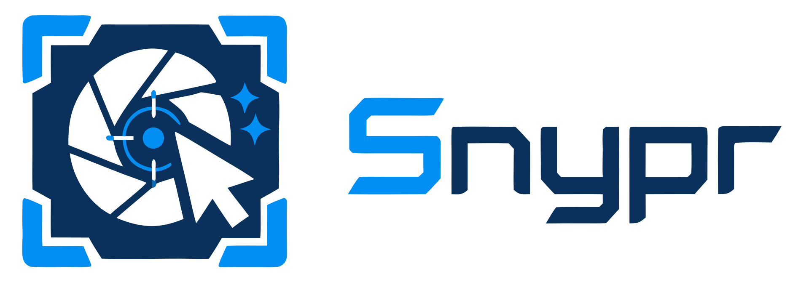

<p align="center">
  
</p>

<p align="center"><strong>Capture, annotate, and draw on Wayland</strong></p>

<p align="center">
  <a href="https://github.com/noirbizarre/snypr/actions/workflows/ci.yml"></a>
  <a href="https://codecov.io/gh/noirbizarre/snypr"></a>
  <a href="https://github.com/noirbizarre/snypr/releases/latest"></a>
  <a href="https://aur.archlinux.org/packages/snypr-bin"></a>
  <a href="https://github.com/noirbizarre/snypr/blob/main/LICENSE"></a>
</p>

---

A GTK4-based screenshot, annotation, and live-drawing tool for [Hyprland](https://hyprland.org/).

Snypr pulls together what currently requires three separate tools on a Wayland desktop:

- **Capture** — like [`grim`](https://sr.ht/~emersion/grim/) / [HyprCapture](https://github.com/gfhdhytghd/HyprCapture), but native and integrated.
- **Annotate** — like [Satty](https://github.com/Satty-org/Satty): arrow, rectangle, ellipse, line, highlight, blur, text, freehand, numbered marker, redact, crop. A built-in Select mode (active when no tool is) moves, resizes, and re-edits shapes you've already drawn.
- **Draw live on the screen** — like [Draw-On-Gnome](https://github.com/daveprowse/Draw-On-Gnome) but on wlroots / Hyprland, ideal for streaming and Google Meet presentations.

Screen capture talks the `zwlr_screencopy_manager_v1` Wayland protocol directly; UI is GTK4 with `gtk4-layer-shell`, and the annotation canvas uses GSK render nodes for GPU-accelerated drawing.

## Status

The four subcommands are wired end-to-end. All eleven annotation tools (Rect, Ellipse, Arrow,
Line, Highlight, Freehand, Number, Text, Blur, Redact, Crop) render through GSK render nodes on
screen and flatten to PNG through Cairo on save. With no tool active, a Select mode picks an
existing shape to move it, resize it via drag handles, re-edit text, or delete it.

| Subcommand    | Status                                                                            |
| ------------- | --------------------------------------------------------------------------------- |
| `screenshot`  | Capture pipeline, all selection modes, file/clipboard sinks, `--per-output`, `--edit` opens the in-place annotation overlay before sinks |
| `draw`        | Live overlay with pointer passthrough toggle, exclusive keyboard, shared tools; Ctrl+S saves via the zone selector |
| `daemon`      | IPC server: `Ping`, `Screenshot`, `DrawToggle`, `PassthroughToggle`; tray (StatusNotifierItem) with `--systray` |
| `doctor`      | Markdown diagnostic report covering version, environment, configuration and live capability probes (Hyprland IPC, wlr-screencopy, daemon socket) |

## Build

```sh
mise run build           # cargo build
mise run test            # cargo nextest run
mise run lint            # cargo clippy --all-targets --all-features -- -Dclippy::all
mise run fmt             # cargo fmt --all
mise run cover           # cargo llvm-cov nextest --all-features
mise run spell           # typos
```

### Build dependencies

Arch Linux (primary target):

```sh
sudo pacman -S --needed gtk4 gtk4-layer-shell wayland pkgconf
```

Debian / Ubuntu:

```sh
sudo apt install libgtk-4-dev libgtk4-layer-shell-dev libwayland-dev pkg-config
```

### Runtime dependencies

- A wlroots-based Wayland compositor exposing the
  `zwlr_screencopy_manager_v1` protocol — Hyprland is the primary target;
  sway, river, and other wlroots compositors should also work.
- GTK4 stack at runtime.
  - Arch Linux:
    ```sh
    sudo pacman -S --needed gtk4 gtk4-layer-shell wayland
    ```
  - Debian / Ubuntu:
    ```sh
    sudo apt install libgtk-4-1 libgtk4-layer-shell0 libwayland-client0
    ```
- Optional, only when running `snypr daemon --systray` (the `tray`
  feature): a StatusNotifierItem host such as `waybar` (with the tray
  module), `swaync`, or `ironbar`.
- Optional, only when the `notify` feature surfaces errors as desktop
  toasts (default): a notification daemon implementing
  `org.freedesktop.Notifications`, e.g. `mako`, `dunst`, or `swaync`.

No external CLI helpers are invoked: `hyprctl`, `grim`, `slurp`, and
`wl-copy` are **not** required. Hyprland IPC is spoken directly over the
command socket, Wayland capture goes through `zwlr_screencopy_manager_v1`,
and clipboard writes use `wl-clipboard-rs`. One-shot invocations briefly fork a
detached child to keep serving the Wayland selection after the CLI exits — the
daemon publishes in-process and skips that fork.

## Install

### Arch Linux

```sh
paru -S snypr-bin   # prebuilt binary, no compilation
paru -S snypr       # built from the release tarball
paru -S snypr-git   # built from the main branch
```

`snypr-bin` is the recommended path: it installs the binary published with each
release, along with the desktop entries, icons and manpage.

### Other distributions

Ubuntu packaging is planned through
[hyprland-ppa](https://github.com/cpiber/hyprland-ppa). Until then, build from
source with `cargo install --path .` (or `mise run setup`), which drops the
binary in `~/.cargo/bin` — note the launcher integration below assumes a proper
package, so you will need to install the desktop files and icons yourself.

### Release assets

Each [release](https://github.com/noirbizarre/snypr/releases) publishes:

| Asset | Contents |
| --- | --- |
| `snypr-<version>-x86_64-unknown-linux-gnu.tar.gz` | Prebuilt binary plus the desktop entries, icons and manpage, laid out as a `$PREFIX` tree |
| `snypr-<version>.tar.gz` | Source tarball — what packagers should consume |
| `SHA256SUMS` | Checksums for both |

The prebuilt binary is **built on and supported for Arch Linux only**. Snypr
links GTK4 and gtk4-layer-shell dynamically, so it requires a matching GTK4
stack (GTK ≥ 4.14 and gtk4-layer-shell ≥ 1.0) on the target system. It may work
elsewhere, but that is not a promise we can keep — build from source instead.

### For packagers

The source tree ships these artifacts ready to install under `$PREFIX`
(typically `/usr`):

| Path                                                                | Provenance                                       |
| ------------------------------------------------------------------- | ------------------------------------------------ |
| `$PREFIX/bin/snypr`                                              | `cargo build --release` → `target/release/snypr` |
| `$PREFIX/share/icons/hicolor/<size>/apps/noirbizar.re.Snypr.png` | `data/icons/hicolor/<size>/apps/…` — sizes 16, 32, 48, 64, 128, 256, 512 |
| `$PREFIX/share/icons/hicolor/scalable/apps/noirbizar.re.Snypr.svg` | `data/icons/hicolor/scalable/apps/…` — preferred by consumers that scale |
| `$PREFIX/share/applications/noirbizar.re.Snypr.desktop`          | Standalone launcher with Screenshot/Draw actions |
| `$PREFIX/share/applications/noirbizar.re.Snypr.Daemon.desktop`   | Visible launcher for `snypr daemon --systray` |
| `$PREFIX/share/man/man1/snypr.1`                                 | `docs/man/snypr.1`                            |
| `$PREFIX/share/licenses/$pkgname/LICENSE`                        | `LICENSE`                                     |
| `$PREFIX/share/doc/$pkgname/README.md`                           | `README.md`                                   |

After installation, package post-install hooks should run
`update-desktop-database` against `$PREFIX/share/applications` and
`gtk-update-icon-cache -qtf $PREFIX/share/icons/hicolor`. On Arch both are
handled by the `desktop-file-utils` and `hicolor-icon-theme` hooks, both of
which the PKGBUILDs in `packaging/aur/` list in `depends`, so they carry no
`.install` file.

The standalone `.desktop` exposes three launcher actions (visible via
right-click in most launchers): **Take Screenshot (region)**, **Take
Full-Screen Screenshot**, and **Draw on Screen**. The daemon entry
(`noirbizar.re.Snypr.Daemon.desktop`) carries
`X-GNOME-Autostart-Enabled=true`, so users who prefer XDG autostart over
the Hyprland snippet below can symlink it into `~/.config/autostart/`.

## Usage

```sh
# Full-screen capture, stitched across all outputs, saved as PNG.
snypr screenshot --full --to file=/tmp/shot.png

# Default sinks come from ~/.config/snypr/config.toml; without --to,
# the screenshot is written to $XDG_PICTURES_DIR/Screenshots/.
snypr screenshot --full

# One file per output. `{output}` is inserted into the filename template
# automatically when the template does not already contain it.
snypr screenshot --full --per-output

# Specific output by name, copied to the clipboard.
snypr screenshot --output DP-1 --to clipboard

# Send the screenshot to both the regular clipboard and the X11-style primary
# selection (middle-click paste). Per-sink form: --to clipboard=primary.
snypr screenshot --full --to clipboard --clipboard-type both

# Focused monitor, queried over Hyprland IPC.
snypr screenshot --focused

# Currently active window, queried over Hyprland IPC.
snypr screenshot --window

# Explicit region (logical pixels): X,Y,WxH.
snypr screenshot --region 100,200,800x600 --to file

# Open the interactive selector explicitly (also the default with no selection flag).
snypr screenshot --interactive

# Interactive region selector → in-place annotation overlay → sinks.
snypr screenshot --edit --to clipboard --to file

# Live draw-on-screen overlay (see the keybind table below for the full tool list,
# Ctrl+Z undo, P passthrough, Esc quit).
snypr draw --to file --to clipboard --cursor

# Run the daemon (IPC server) on a custom socket path.
snypr daemon --socket /run/user/1000/snypr.sock

# Live overlay opened with pointer passthrough already on (clicks fall through).
snypr draw --passthrough

# Run the daemon (IPC server; add `--systray` for a StatusNotifierItem icon).
snypr daemon

# Take a screenshot via the running daemon instead of spawning a fresh process.
snypr screenshot --full --via-daemon
```

### Interactive selector

The selector (shown by `screenshot` with no explicit selection flag, or with
`--interactive`) shows a floating
toolbar on the focused monitor with four modes — **Full**, **Screen**, **Window**,
**Region** — plus a cursor toggle, a delay spinner, an output-destination switcher, and a
**Capture** button. The toolbar follows keyboard
focus: it moves to whichever monitor you focus, while every monitor keeps its dimming
overlay. Hold `Shift` while clicking Capture (the button's icon swaps live) to *also* open
the in-place editor on the captured image; while Shift is held the destination switcher
greys out, because the editor that opens carries its own. Whatever destination you picked
in the selector seeds that editor's switcher. Keyboard shortcuts: `1/2/3/4` switch modes, drag
with the mouse in Region mode, click on a monitor in Screen mode, then press `Enter`
(Capture) or `Shift+Enter` / `Shift+KP_Enter` (Capture + Annotate) to commit. `Esc` cancels.

### Editor & overlay keybinds

These are currently fixed and not configurable.

| Key      | Action                       |
| -------- | ---------------------------- |
| `R`      | Rectangle tool               |
| `O`      | Ellipse tool                 |
| `A`      | Arrow tool                   |
| `L`      | Line tool (no arrowhead)     |
| `H`      | Highlight tool               |
| `F`      | Freehand tool                |
| `N`      | Numbered marker              |
| `T`      | Text                         |
| `B`      | Blur                         |
| `X`      | Redact (solid black)         |
| `C`      | Crop (editor only)           |
| `Ctrl+Z` | Undo last layer              |
| `Ctrl+S` / `Enter` | Save (editor and draw overlay) |
| `Ctrl+O` | Cycle output destination: file → clipboard → both |
| `P`      | Toggle pointer passthrough (overlay only) |
| `Ctrl+L` | Clear all layers (overlay only)           |
| `Delete` / `Backspace` | Delete the selected shape (Select mode) |
| Arrow keys | Nudge the selected shape (`Shift` = larger step) |
| `Esc`    | Deselect (Select mode) / Quit |

There is no dedicated Select button: **with no tool active, the editor is in Select mode.**
Click an active tool's button (or press its key again) to deactivate it, and after you
commit a shape the editor returns to Select mode automatically.

In **Select mode** you edit shapes you've already drawn. Click a shape to select it (handles
appear), drag its body to move it, or drag a handle to resize it — box shapes get eight
handles, Arrow/Line expose their two endpoints, and a numbered marker exposes a radius grip.
For text, the corner handles scale the font size while the side handles set a wrap width
(so long lines reflow). Double-click a text annotation to re-open its editor in place;
`Delete` / `Backspace` removes the selection and `Esc` deselects. Freehand strokes can be
selected and moved but not resized.

A color picker (with alpha) and a stroke-style picker sit next to the tool buttons. Each
tool remembers its own color/style across switches within a session; the pickers also act on
the currently selected shape (or the text being edited), and font size is editable while a
text shape is selected or edited. The pickers are disabled for tools whose appearance is
hardcoded (Blur, Crop, Redact) and when nothing relevant is selected.

Next to the Save button — and, on the selector, just before **Capture** — an
**output-destination switcher** shows where the next save will go. It starts on whatever
`--to` (or `[output].default_sinks`) resolved to, and clicking it
— or pressing `Ctrl+O` — cycles file → clipboard → both. An explicit `--to file=PATH` target
and a pinned `--to clipboard=KIND` are remembered, so cycling away and back is lossless.

In the **draw overlay**, `Ctrl+S` (or `Enter`, or the toolbar Save button) pops the
screenshot zone selector so you choose what part of the screen to capture (region,
monitor, window, or full desktop). Because the strokes are already painted on the
layer-shell surfaces, the captured PNG naturally contains "desktop + strokes" — no
post-processing. The overlay stays alive with strokes intact after saving, so you can
keep drawing or save another zone. Sinks come from `--to` (repeatable; defaults to
`[output].default_sinks` from the config) and can be changed on the fly with the toolbar's
output-destination switcher, and `--cursor` seeds the selector's cursor toggle.

Next to the color picker, a stroke-style picker offers Solid / Dashed / Dotted dash
patterns for the outline-rendering tools (Rectangle, Ellipse, Arrow, Line, Freehand).
Like the color picker, each tool remembers its own style across switches. The Arrow
tool's shaft honours the style while its arrowhead stays solid so it remains a
recognisable pointer.

The picker opens GTK's native `GtkColorDialog`. Placement, sizing, and the resize
behaviour when toggling the *Custom Color* editor are delegated to the compositor —
`GtkColorDialog` does not expose its window to applications. On Hyprland (0.55+, Lua
config), add a window rule if you want it to always float and centre:

```lua
hl.window_rule({
  match  = { title = "^Pick a Color$" },
  float  = true,
  center = true,
})
```

### Hyprland keybindings

Drop the following into your Hyprland Lua config (e.g.
`~/.config/hypr/hyprland.lua`) — adjust paths/mods to taste:

```lua
-- Default screenshot (uses the configured defaults from ~/.config/snypr/config.toml).
hl.bind("SUPER + Print", hl.dsp.exec_cmd("snypr screenshot"))

-- Full desktop, stitched across every output, written to the configured directory.
hl.bind("SUPER + SHIFT + Print",
    hl.dsp.exec_cmd("snypr screenshot --full --to file"))

-- One PNG per monitor; {output} is inserted into the template automatically.
hl.bind("SUPER + SHIFT + ALT + Print",
    hl.dsp.exec_cmd("snypr screenshot --full --per-output --to file"))

-- Currently focused monitor (queried over Hyprland IPC), copied to the clipboard.
hl.bind("SUPER + CTRL + Print",
    hl.dsp.exec_cmd("snypr screenshot --focused --to clipboard"))

-- Currently active window (queried over Hyprland IPC), copied to the clipboard.
hl.bind("SUPER + CTRL + SHIFT + Print",
    hl.dsp.exec_cmd("snypr screenshot --window --to clipboard"))

-- Live draw-on-screen overlay — ideal for presentations / Google Meet.
-- See the README keybind table for the full tool/action list; Esc quits.
hl.bind("SUPER + ALT + Print", hl.dsp.exec_cmd("snypr draw"))

-- Toggle pointer passthrough on a running draw overlay. Useful because
-- passthrough mode detaches the surface from the keyboard, so the overlay's
-- own `P` shortcut can't turn passthrough back off — a global keybind can.
hl.bind("SUPER + ALT + P",
    hl.dsp.exec_cmd("snypr draw --via-daemon --toggle-passthrough"))

-- Autostart the daemon (enables `--via-daemon`; add `--systray` for a tray icon).
hl.on("hyprland.start", function()
    hl.exec_cmd("snypr daemon --systray")
end)
```

### Troubleshooting

**Pressing the keybind does nothing?**

1. Inspect the actually-registered bind:
   ```sh
   hyprctl binds | grep -i print
   ```
   The dispatcher must be `exec` (not `exec_cmd` — that's the load-time
   directive). If your config layer (Nix module, etc.) emits `exec_cmd` inside
   a `bind`, Hyprland silently drops it.
2. Confirm the binary resolves on Hyprland's `PATH`:
   ```sh
   hyprctl dispatch exec "which snypr"
   tail -n5 ~/.local/share/hyprland/hyprland.log
   ```
3. Check Hyprland's log for stderr from the spawned snypr process — that's
   where errors land when launched from a keybind. The optional `notify`
   feature (enabled by default) also surfaces fatal errors as a desktop
   notification.
4. Add `-vv` to your bind (e.g. `snypr -vv screenshot`) to upgrade the
   `snypr` log level to trace without needing `RUST_LOG`.

## Environment variables

| Variable | Effect |
| -------- | ------ |
| `SNYPR_CONFIG` | Alternative config file path. Equivalent to `--config`. |
| `SNYPR_LANG` | UI language as a BCP-47 tag. Equivalent to `--lang`. |
| `RUST_LOG` | Standard `tracing-subscriber` filter. Overridden by `-v` / `-vv`. |
| `SNYPR_CAPTURE_GRACE_MS` | Milliseconds to wait between dismissing the selector and grabbing pixels (default `30`). Raise it if selector chrome leaks into the capture on a slow compositor. |

## Configuration

`~/.config/snypr/config.toml` (every field is optional):

```toml
# UI language as a BCP-47 tag. Overridden by `--lang` / `SNYPR_LANG`; when unset,
# falls back to `LC_ALL` / `LC_MESSAGES` / `LANG`, then English. Shipped catalogs: en, fr.
language = "en"

[output]
directory          = "/home/me/Pictures/Screenshots"
filename_template  = "snypr_{date}_{time}_{output}.png"
default_sinks      = ["file", "clipboard"]
use_utc            = false
# PNG compression preset: "fast" (largest, fastest), "balanced" (default), or "best"
# (smallest, ~10x slower than fast). Balanced typically halves file size vs fast.
compression        = "balanced"

[capture]
# Include the pointer in captures by default. `--cursor` turns it on for a single
# invocation; because the flag is a bare boolean it can only enable, so with
# `cursor = true` use the selector's cursor toggle to leave it out of one capture.
cursor = false
# Pre-capture delay in whole seconds. `0` (or omitted) means no delay. The CLI's
# `--delay SECONDS` flag overrides this value.
delay  = 0
# Mode button pre-selected when the interactive selector opens. One of
# `full` (all monitors), `screen` (focused monitor, default), `window`
# (click-to-pick), or `region` (drag-to-pick). The selector's mode buttons
# still let the user switch freely; this only seeds the initial state.
initial_mode = "screen"

[clipboard]
# Default selection used by bare `--to clipboard` sinks. One of `regular`
# (Ctrl-V paste, default), `primary` (middle-click paste), or `both`. Overridden
# per-invocation by `--clipboard-type`, and per-sink by `--to clipboard=KIND`.
default_kind = "regular"

[notify]
# Emit a desktop notification (with thumbnail) on a successful screenshot.
success    = true
# Emit a desktop notification on a fatal error (useful for keybind launches).
error      = true
# Notification expiry, in milliseconds.
timeout_ms = 6000

[ui.selector]
# Chrome colors for the region/full/screen/window selector and the standalone
# pre-capture countdown window. Hex RGBA strings: "#RRGGBB" (fully opaque) or
# "#RRGGBBAA". Every field is optional; omitted fields keep their defaults.
outline      = "#FFFFFFF2"  # active/selected zone (region rect, selected screen/window)
outline_hover = "#FFFFFFF2" # hovered (not yet committed) screen/window outline
label        = "#FFFFFFE6"  # region size legend + top-of-monitor hint text
dim_strong   = "#0000008C"  # heavy veil outside selection / non-selected screens
dim_full     = "#00000073"  # veil in region mode before a rectangle is drawn
dim_light    = "#00000040"  # full mode + hovered/selected screen
countdown_fg = "#FFFFFFF2"  # pre-capture countdown numeral fill
countdown_bg = "#0000008C"  # standalone countdown window background

[annotate.colors]
# Default color picked by each annotation tool when the editor / draw overlay
# opens. Hex RGBA strings: "#RRGGBB" (fully opaque) or "#RRGGBBAA". Every field
# is optional; omitted fields keep their defaults. The toolbar's color picker
# still lets the user change colors at runtime. `Blur`, `Crop`, and `Redact`
# are not listed because their appearance is hardcoded.
rect      = "#FF0000"    # rectangle outline
ellipse   = "#FF0000"    # ellipse outline
arrow     = "#FF0000"    # arrow stroke + head fill
line      = "#FF0000"    # straight-line stroke
freehand  = "#FF0000"    # freehand stroke
highlight = "#FFFF0059"  # translucent yellow fill
number    = "#E61A1A"    # number badge background (text stays white)
text      = "#FFF333"    # text foreground
```

Template tokens: `{ts}`, `{date}`, `{time}`, `{output}`, `{selection}`.

## Architecture

The crate is a single binary with internal modules:

```
src/
├── cli/         # clap subcommands (screenshot, draw, daemon, doctor)
├── capture/     # wlr-screencopy backend (smithay-client-toolkit)
├── annotate/    # document model, tool trait, GSK-free helpers
├── output/      # file + clipboard sinks
├── ui/          # GTK4 windows + AnnotationCanvas (gated behind `ui` feature)
├── bridge.rs    # async <-> GTK glue (gated behind `ui` feature)
├── context.rs   # shared Ctx = Arc<Context>
├── hypr.rs      # Hyprland IPC
├── i18n.rs      # Fluent catalogs + the `fl!` macro
├── ipc.rs       # daemon protocol
├── daemon.rs    # Unix-socket IPC server
├── notify.rs    # desktop notifications (gated behind `notify` feature)
├── path.rs      # tilde expansion helpers
└── config.rs    # TOML configuration
```

## Acknowledgements

Toolbar icons are sourced from the GNOME [icon-development-kit](https://gitlab.gnome.org/Teams/Design/icon-development-kit)
and bundled under [CC0 1.0](https://creativecommons.org/publicdomain/zero/1.0/).
See `data/icons/LICENSE.md` for details.

## License

MIT. See [LICENSE](LICENSE).
