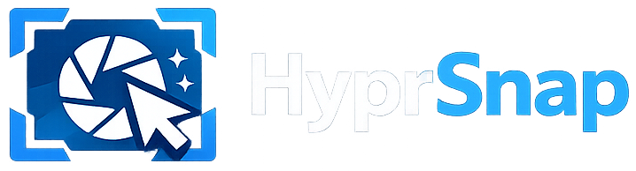

<p align="center">
  
</p>

A GTK4-based screenshot, annotation, and live-drawing tool for [Hyprland](https://hyprland.org/).

HyprSnap pulls together what currently requires three separate tools on a Wayland desktop:

- **Capture** — like [`grim`](https://sr.ht/~emersion/grim/) / [HyprCapture](https://github.com/gfhdhytghd/HyprCapture), but native and integrated.
- **Annotate** — like [Satty](https://github.com/Satty-org/Satty): arrow, rectangle, ellipse, highlight, blur, text, freehand, numbered marker, redact, crop.
- **Draw live on the screen** — like [Draw-On-Gnome](https://github.com/daveprowse/Draw-On-Gnome) but on wlroots / Hyprland, ideal for streaming and Google Meet presentations.

Screen capture talks the `zwlr_screencopy_manager_v1` Wayland protocol directly; UI is GTK4 with `gtk4-layer-shell`, and the annotation canvas uses GSK render nodes for GPU-accelerated drawing.

## Status

The four subcommands are wired end-to-end. All ten annotation tools (Rect, Ellipse, Arrow,
Highlight, Freehand, Number, Text, Blur, Redact, Crop) render through GSK render nodes on
screen and flatten to PNG through Cairo on save.

| Subcommand    | Status                                                                            |
| ------------- | --------------------------------------------------------------------------------- |
| `screenshot`  | Capture pipeline, all selection modes, file/clipboard sinks, `--per-output`, `--edit` opens the in-place annotation overlay before sinks |
| `draw`        | Live overlay with pointer passthrough toggle, exclusive keyboard, shared tools; Ctrl+S saves via the zone selector |
| `daemon`      | IPC server: `Ping`, `Screenshot`, `DrawToggle`, `PassthroughToggle`; tray (StatusNotifierItem) when enabled in config |
| `doctor`      | Markdown diagnostic report covering version, environment, configuration and live capability probes (Hyprland IPC, wlr-screencopy, daemon socket) |

## Build

```sh
mise run build           # cargo build
mise run test            # cargo nextest run
mise run lint            # cargo clippy --all-targets --all-features -- -Dclippy::all
mise run fmt             # cargo fmt --all
mise run cover           # cargo llvm-cov nextest
```

### Build dependencies

Arch Linux (primary target):

```sh
sudo pacman -S --needed gtk4 gtk4-layer-shell wayland pkgconf
```

Debian / Ubuntu:

```sh
sudo apt install libgtk-4-dev libgtk4-layer-shell-dev libwayland-dev pkg-config
```

### Runtime dependencies

- A wlroots-based Wayland compositor exposing the
  `zwlr_screencopy_manager_v1` protocol — Hyprland is the primary target;
  sway, river, and other wlroots compositors should also work.
- GTK4 stack at runtime.
  - Arch Linux:
    ```sh
    sudo pacman -S --needed gtk4 gtk4-layer-shell wayland
    ```
  - Debian / Ubuntu:
    ```sh
    sudo apt install libgtk-4-1 libgtk4-layer-shell0 libwayland-client0
    ```
- Optional, only when running `hyprsnap daemon --systray` (the `tray`
  feature): a StatusNotifierItem host such as `waybar` (with the tray
  module), `swaync`, or `ironbar`.
- Optional, only when the `notify` feature surfaces errors as desktop
  toasts (default): a notification daemon implementing
  `org.freedesktop.Notifications`, e.g. `mako`, `dunst`, or `swaync`.

No external CLI helpers are invoked: `hyprctl`, `grim`, `slurp`, and
`wl-copy` are **not** required. Hyprland IPC is spoken directly over the
command socket, Wayland capture goes through `zwlr_screencopy_manager_v1`,
and clipboard writes use `wl-clipboard-rs`. One-shot invocations briefly fork a
detached child to keep serving the Wayland selection after the CLI exits — the
daemon publishes in-process and skips that fork.

## Install

End-user installs will arrive via distribution packages (AUR, Debian/Ubuntu,
Nix, …) once published — that's the supported path. In the meantime you can
`cargo install --path .` (or `mise run setup`) to drop the binary in
`~/.cargo/bin`; the launcher integration below assumes a proper package.

For packagers, the source tree ships these artifacts ready to install under
`$PREFIX` (typically `/usr`):

| Path                                                                | Provenance                                       |
| ------------------------------------------------------------------- | ------------------------------------------------ |
| `$PREFIX/bin/hyprsnap`                                              | `cargo build --release` → `target/release/hyprsnap` |
| `$PREFIX/share/icons/hicolor/<size>/apps/noirbizar.re.HyprSnap.png` | `data/icons/hicolor/<size>/apps/…` — sizes 16, 32, 64, 128, 256, 512 |
| `$PREFIX/share/applications/noirbizar.re.HyprSnap.desktop`          | Standalone launcher with Screenshot/Draw actions |
| `$PREFIX/share/applications/noirbizar.re.HyprSnap.Daemon.desktop`   | Visible launcher for `hyprsnap daemon --systray` |
| `$PREFIX/share/man/man1/hyprsnap.1`                                 | `docs/man/hyprsnap.1`                            |

After installation, package post-install hooks should run
`update-desktop-database` against `$PREFIX/share/applications` and
`gtk-update-icon-cache -qtf $PREFIX/share/icons/hicolor`.

The standalone `.desktop` exposes three launcher actions (visible via
right-click in most launchers): **Take Screenshot (region)**, **Take
Full-Screen Screenshot**, and **Draw on Screen**. The daemon entry
(`noirbizar.re.HyprSnap.Daemon.desktop`) carries
`X-GNOME-Autostart-Enabled=true`, so users who prefer XDG autostart over
the Hyprland snippet below can symlink it into `~/.config/autostart/`.

## Usage

```sh
# Full-screen capture, stitched across all outputs, saved as PNG.
hyprsnap screenshot --full --to file=/tmp/shot.png

# Default sinks come from ~/.config/hyprsnap/config.toml; without --to,
# the screenshot is written to $XDG_PICTURES_DIR/Screenshots/.
hyprsnap screenshot --full

# One file per output (uses {output} in the filename template).
hyprsnap screenshot --full --per-output

# Specific output by name, copied to the clipboard.
hyprsnap screenshot --output DP-1 --to clipboard

# Send the screenshot to both the regular clipboard and the X11-style primary
# selection (middle-click paste). Per-sink form: --to clipboard=primary.
hyprsnap screenshot --full --to clipboard --clipboard-type both

# Focused window, queried over Hyprland IPC.
hyprsnap screenshot --focused

# Explicit region (logical pixels): X,Y,WxH.
hyprsnap screenshot --region 100,200,800x600 --to file

# Interactive region selector → in-place annotation overlay → sinks.
hyprsnap screenshot --edit --to clipboard --to file

# Live draw-on-screen overlay (see the keybind table below for the full tool list,
# Ctrl+Z undo, P passthrough, Esc quit).
hyprsnap draw --to file --to clipboard --cursor

# Run the daemon (IPC server; add `--systray` for a StatusNotifierItem icon).
hyprsnap daemon

# Take a screenshot via the running daemon instead of spawning a fresh process.
hyprsnap screenshot --full --via-daemon
```

### Interactive selector

The selector (used by `screenshot --edit` and the default `screenshot`) shows a floating
toolbar on the primary monitor with four modes — **Full**, **Screen**, **Window**,
**Region** — plus a cursor toggle and a **Capture** button. Hold `Shift` while
clicking Capture (the button's icon swaps live) to *also* open the in-place editor on
the captured image. Keyboard shortcuts: `1/2/3/4` switch modes, drag with the mouse in
Region mode, click on a monitor in Screen mode, then press `Enter` (Capture) or
`Shift+Enter` (Capture + Annotate) to commit. `Esc` cancels.

### Editor & overlay keybinds

| Key      | Action                       |
| -------- | ---------------------------- |
| `R`      | Rectangle tool               |
| `O`      | Ellipse tool                 |
| `A`      | Arrow tool                   |
| `L`      | Line tool (no arrowhead)     |
| `H`      | Highlight tool               |
| `F`      | Freehand tool                |
| `N`      | Numbered marker              |
| `T`      | Text (popover entry)         |
| `B`      | Blur (editor only)           |
| `X`      | Redact (solid black)         |
| `C`      | Crop (editor only)           |
| `Ctrl+Z` | Undo last layer              |
| `Ctrl+S` / `Enter` | Save (editor and draw overlay) |
| `P`      | Toggle pointer passthrough (overlay only) |
| `Ctrl+L` | Clear all layers (overlay only)           |
| `Esc`    | Quit                         |

A color picker (with alpha) sits next to the tool buttons. Each tool remembers its own
color across switches within a session; it's disabled for tools whose appearance is
hardcoded (Blur, Crop, Redact).

In the **draw overlay**, `Ctrl+S` (or `Enter`, or the toolbar Save button) pops the
screenshot zone selector so you choose what part of the screen to capture (region,
monitor, window, or full desktop). Because the strokes are already painted on the
layer-shell surfaces, the captured PNG naturally contains "desktop + strokes" — no
post-processing. The overlay stays alive with strokes intact after saving, so you can
keep drawing or save another zone. Sinks come from `--to` (repeatable; defaults to
`[output].default_sinks` from the config), and `--cursor` seeds the selector's cursor toggle.

Next to the color picker, a stroke-style picker offers Solid / Dashed / Dotted dash
patterns for the outline-rendering tools (Rectangle, Ellipse, Arrow, Line, Freehand).
Like the color picker, each tool remembers its own style across switches. The Arrow
tool's shaft honours the style while its arrowhead stays solid so it remains a
recognisable pointer.

The picker opens GTK's native `GtkColorDialog`. Placement, sizing, and the resize
behaviour when toggling the *Custom Color* editor are delegated to the compositor —
`GtkColorDialog` does not expose its window to applications. On Hyprland (0.55+, Lua
config), add a window rule if you want it to always float and centre:

```lua
hl.window_rule({
  match  = { title = "^Pick a Color$" },
  float  = true,
  center = true,
})
```

### Hyprland keybindings

Drop the following into your Hyprland Lua config (e.g.
`~/.config/hypr/hyprland.lua`) — adjust paths/mods to taste:

```lua
-- Default screenshot (uses the configured defaults from ~/.config/hyprsnap/config.toml).
hl.bind("SUPER + Print", hl.dsp.exec_cmd("hyprsnap screenshot"))

-- Full desktop, stitched across every output, written to the configured directory.
hl.bind("SUPER + SHIFT + Print",
    hl.dsp.exec_cmd("hyprsnap screenshot --full --to file"))

-- One PNG per monitor (uses {output} in the filename template).
hl.bind("SUPER + SHIFT + ALT + Print",
    hl.dsp.exec_cmd("hyprsnap screenshot --full --per-output --to file"))

-- Currently focused window (queried over Hyprland IPC), copied to the clipboard.
hl.bind("SUPER + CTRL + Print",
    hl.dsp.exec_cmd("hyprsnap screenshot --focused --to clipboard"))

-- Live draw-on-screen overlay — ideal for presentations / Google Meet.
-- See the README keybind table for the full tool/action list; Esc quits.
hl.bind("SUPER + ALT + Print", hl.dsp.exec_cmd("hyprsnap draw"))

-- Toggle pointer passthrough on a running draw overlay. Useful because
-- passthrough mode detaches the surface from the keyboard, so the overlay's
-- own `P` shortcut can't turn passthrough back off — a global keybind can.
hl.bind("SUPER + ALT + P",
    hl.dsp.exec_cmd("hyprsnap draw --via-daemon --toggle-passthrough"))

-- Autostart the daemon (enables `--via-daemon`; add `--systray` for a tray icon).
hl.on("hyprland.start", function()
    hl.exec_cmd("hyprsnap daemon --systray")
end)
```

### Troubleshooting

**Pressing the keybind does nothing?**

1. Inspect the actually-registered bind:
   ```sh
   hyprctl binds | grep -i print
   ```
   The dispatcher must be `exec` (not `exec_cmd` — that's the load-time
   directive). If your config layer (Nix module, etc.) emits `exec_cmd` inside
   a `bind`, Hyprland silently drops it.
2. Confirm the binary resolves on Hyprland's `PATH`:
   ```sh
   hyprctl dispatch exec "which hyprsnap"
   tail -n5 ~/.local/share/hyprland/hyprland.log
   ```
3. Check Hyprland's log for stderr from the spawned hyprsnap process — that's
   where errors land when launched from a keybind. The optional `notify`
   feature (enabled by default) also surfaces fatal errors as a desktop
   notification.
4. Add `-vv` to your bind (e.g. `hyprsnap -vv screenshot`) to upgrade the
   `hyprsnap` log level to trace without needing `RUST_LOG`.

## Configuration

`~/.config/hyprsnap/config.toml` (every field is optional):

```toml
[output]
directory          = "/home/me/Pictures/Screenshots"
filename_template  = "hyprsnap_{date}_{time}_{output}.png"
default_sinks      = ["file", "clipboard"]
use_utc            = false
# PNG compression preset: "fast" (largest, fastest), "balanced" (default), or "best"
# (smallest, ~10x slower than fast). Balanced typically halves file size vs fast.
compression        = "balanced"

[capture]
cursor = false
# Pre-capture delay in whole seconds. `0` (or omitted) means no delay. The CLI's
# `--delay SECONDS` flag overrides this value.
delay  = 0
# Mode button pre-selected when the interactive selector opens. One of
# `full` (all monitors), `screen` (focused monitor, default), `window`
# (click-to-pick), or `region` (drag-to-pick). The selector's mode buttons
# still let the user switch freely; this only seeds the initial state.
initial_mode = "screen"

[clipboard]
# Default selection used by bare `--to clipboard` sinks. One of `regular`
# (Ctrl-V paste, default), `primary` (middle-click paste), or `both`. Overridden
# per-invocation by `--clipboard-type`, and per-sink by `--to clipboard=KIND`.
default_kind = "regular"

[keybinds.selector]
cancel  = "Escape"
confirm = "Return"

[keybinds.editor]
save = "<Ctrl>s"
copy = "<Ctrl>c"
quit = "Escape"

[keybinds.overlay]
toggle_passthrough = "p"
snapshot           = "s"
quit               = "Escape"

[notify]
# Emit a desktop notification (with thumbnail) on a successful screenshot.
success    = true
# Emit a desktop notification on a fatal error (useful for keybind launches).
error      = true
# Notification expiry, in milliseconds.
timeout_ms = 6000

[ui.selector]
# Chrome colors for the region/full/screen/window selector and the standalone
# pre-capture countdown window. Hex RGBA strings: "#RRGGBB" (fully opaque) or
# "#RRGGBBAA". Every field is optional; omitted fields keep their defaults.
outline      = "#FFFFFFF2"  # zone/region/window/screen border stroke
label        = "#FFFFFFE6"  # region size legend + top-of-monitor hint text
dim_strong   = "#0000008C"  # heavy veil outside selection / non-selected screens
dim_full     = "#00000073"  # veil in region mode before a rectangle is drawn
dim_light    = "#00000040"  # full mode + hovered/selected screen
countdown_fg = "#FFFFFFF2"  # pre-capture countdown numeral fill
countdown_bg = "#0000008C"  # standalone countdown window background

[annotate.colors]
# Default color picked by each annotation tool when the editor / draw overlay
# opens. Hex RGBA strings: "#RRGGBB" (fully opaque) or "#RRGGBBAA". Every field
# is optional; omitted fields keep their defaults. The toolbar's color picker
# still lets the user change colors at runtime. `Blur`, `Crop`, and `Redact`
# are not listed because their appearance is hardcoded.
rect      = "#FF0000"    # rectangle outline
ellipse   = "#FF0000"    # ellipse outline
arrow     = "#FF0000"    # arrow stroke + head fill
line      = "#FF0000"    # straight-line stroke
freehand  = "#FF0000"    # freehand stroke
highlight = "#FFFF0059"  # translucent yellow fill
number    = "#E61A1A"    # number badge background (text stays white)
text      = "#FFF333"    # text foreground
```

Template tokens: `{ts}`, `{date}`, `{time}`, `{output}`, `{selection}`.

## Architecture

See the design plan at `.opencode/plans/1778929144226-shiny-panda.md` for full details. The crate is a single binary with internal modules:

```
src/
├── cli/         # clap subcommands (screenshot, draw, daemon, doctor)
├── capture/     # wlr-screencopy backend (smithay-client-toolkit)
├── annotate/    # document model, tool trait, GSK-free helpers
├── output/      # file + clipboard sinks
├── ui/          # GTK4 windows + AnnotationCanvas (gated behind `ui` feature)
├── bridge.rs    # async <-> GTK glue (gated behind `ui` feature)
├── context.rs   # shared Ctx = Arc<Context>
├── hypr.rs      # Hyprland IPC
├── ipc.rs       # daemon protocol
├── daemon.rs    # Unix-socket IPC server
├── notify.rs    # desktop notifications (gated behind `notify` feature)
└── config.rs    # TOML configuration
```

## Acknowledgements

Toolbar icons are sourced from the GNOME [icon-development-kit](https://gitlab.gnome.org/Teams/Design/icon-development-kit)
and bundled under [CC0 1.0](https://creativecommons.org/publicdomain/zero/1.0/).
See `data/icons/LICENSE.md` for details.

## License

MIT. See [LICENSE](LICENSE).
